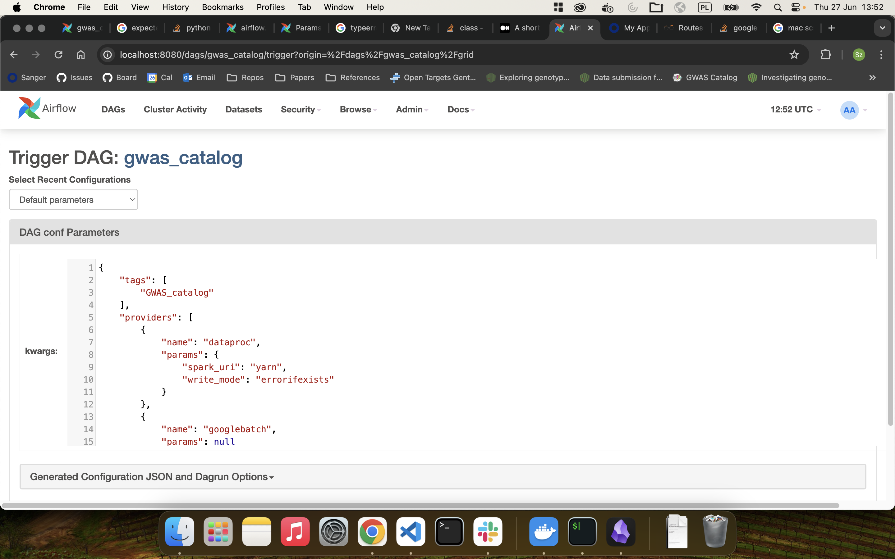

# Open Targets' data pipeline orchestration

## Requirements

The code in this repository is compatible with Linux and Mac only. There are the
following software requirements:

* [uv](https://github.com/astral-sh/uv)
* [Docker](https://docs.docker.com/get-docker/)
* [Google Cloud SDK](https://cloud.google.com/sdk/docs/install)

> [!WARNING]
> On macOS, the default amount of memory available for Docker might not be enough
> to get Airflow up and running. Allocate at least 4GB of memory for the Docker
> Engine (ideally 8GB). [More info](https://airflow.apache.org/docs/apache-airflow/stable/howto/docker-compose/index.html#)

> [!NOTE]
> The terraform script used in creating the cloud instance is currently heavily
> tailored to our internal structure, with many hardcoded values and assumptions.


## Running

### Local
You need to set up local access to the `up-airflow-dev` service account.

Then, run `make dev`. This will start airflow locally and create a virtualenv you
can use with your IDE.

Open http://localhost:8081 in a browser to access the Airflow UI. The default
credentials are `airflow`/`airflow`.

> [!WARNING]
> If you run `docker compose up` by itself, to get a working dev environment you
> must add the override file `compose-local.yaml` as well as set the
> `GOOGLE_APPLICATION_CREDENTIALS` environment variable.

### Google Cloud
Run `make`. This will set up and/or connect you to an airflow dev instance in
Google Cloud; and open vscode into that instance code as well as a the Airflow UI
in a browser automatically. The default credentials are `airflow`/`airflow`.

> [!TIP]
> You should accept the prompt to install the recommended extensions in vscode,
> those are very helpful for working with Airflow DAGs and code.


# Additional information

## Managing Airflow and DAGs

The airflow DAGs sit in the `orchestration` package inside the `dags` directory.
The configuration for the DAGs is located in the `orchestration.dags.config`
package.

Currently the DAGs are under heavy development, so there can be issues while
Airflow tries to parse them. Current development focuses on unification of the
`gwas_catalog_*` dags in `gwas_catalog_dag.py` file in a single DAG. To be able
to run it one need to provide the configuration from the `configs/config.json`
to the dag trigger as in the exaple picture.




## Cleaning up

You can clean up the repository with:

```bash
make clean
```

At any time, you can check the status of your containers with:

```bash
docker ps
```

To stop Airflow, run:

```bash
docker compose down
```

To cleanup the Airflow database, run:

```bash
docker compose down --volumes --remove-orphans
```


## Advanced configuration

More information on running Airflow with Docker Compose can be found in the
[official docs](https://airflow.apache.org/docs/apache-airflow/stable/howto/docker-compose/index.html).

1. **Increase Airflow concurrency**. Modify the `docker-compose.yaml` and add
   the following to the x-airflow-common → environment section:

   ```yaml
   AIRFLOW__CORE__PARALLELISM: 32
   AIRFLOW__CORE__MAX_ACTIVE_TASKS_PER_DAG: 32
   AIRFLOW__SCHEDULER__MAX_TIS_PER_QUERY: 16
   AIRFLOW__CORE__MAX_ACTIVE_RUNS_PER_DAG: 1
   # Also add the following line if you are using CeleryExecutor (by default, LocalExecutor is used).
   AIRFLOW__CELERY__WORKER_CONCURRENCY: 32
   ```

1. **Additional pip packages**. They can be added to the `requirements.txt` file.


## Troubleshooting

Note that when you a a new workflow under `dags/`, Airflow will not pick that up
immediately. By default the filesystem is only scanned for new DAGs every 300s.
However, once the DAG is added, updates are applied nearly instantaneously.

Also, if you edit the DAG while an instance of it is running, it might cause
problems with the run, as Airflow will try to update the tasks and their
properties in DAG according to the file changes.
