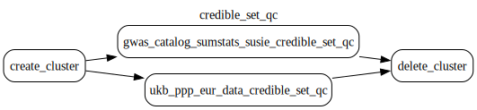

# Credible set qc dag

Credible set qc is a set of operations performed on the `StudyLocus` datasets originally fine-mapped by OpenTargets to:

- Ensure pValue of each locus does meet the pre-defined threshold
- Perform repartitioning of the credible sets, as the output from the batch job contains files per loci, resulting in slow queries.
- Ensure no duplicated loci exist in the clean credible sets.

The dag contains following steps:

- qc of credible sets coming from `gwas_catalog_sumstats_susie` bucket
- qc of credible sets coming from `ukb_ppp_eur_data` bucket

> [!NOTE]
> The outputs of the steps are contained in the target bucket with prefix _credible_set_clean_.
