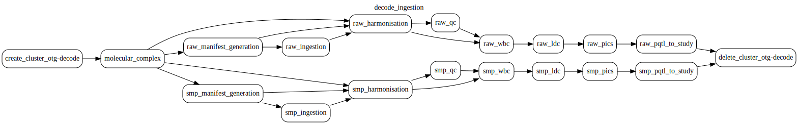

# deCODE proteomics

This document was updated on 2026-06-30.

Data source comes from the [deCODE Genetics summary data](https://www.decode.com/summarydata/). The data source is linked to to 2 publications:

* Ferkingstad, E. et al. Large-scale integration of the plasma proteome with genetics and disease (2021)
* Grímur Hjörleifsson Eldjarn, Egil Ferkingstad et al. Large-scale plasma proteomics comparisons through genetics and disease associations (2023)

The data was originally fetched from s3 compatible storage and put under the `gs://decode_inputs` bucket in parquet format. This initial ingestion was run via a notebook, not the dag. The `decode_ingestion` dag now also contains `manifest_generation` and `ingestion` steps that can fetch the data from the s3 compatible storage, but they are **not** wired into the active dag flow.

> [!CAUTION]
> The `manifest_generation` and `ingestion` steps are expensive and re-download the full deCODE dataset from s3. The data is already present under `gs://decode_inputs`, so these steps should not be re-run just to verify they work — doing so is costly and wasteful of resources.

The data is stored under the following structure:

```{bash}
gs://decode_inputs/somascan_raw_index.txt
gs://decode_inputs/somascan_smp_index.txt
gs://decode_inputs/raw_summary_statistics/raw/
gs://decode_inputs/raw_summary_statistics/smp/
```

The syncing changed only the format from tsv.gz to parquet for easier downstream querying.

Files `gs://decode_inputs/somascan_raw_index.txt` and `gs://decode_inputs/somascan_smp_index.txt` are the index files for the raw summary statistics. (listing from s3 compatible storage)

The raw summary statistics are stored under `gs://decode_inputs/raw_summary_statistics/raw/` and `gs://decode_inputs/raw_summary_statistics/smp/` buckets. The `smp` dataset contains the median-signal-normalised summary statistics, while `raw` contains the non-normalised summary statistics. See the [Design choices](#dual-branch-smp-and-raw) section for the difference between the two.

The harmonized data is stored under the `gs://decode_data` bucket with the following structure:

```{bash}
gs://decode_data/decode_2023_aptamer_mapping.tsv
gs://decode_data/study_tables.xlsx
gs://decode_data/2021-pub-aligned/
gs://decode_data/complex_portal/
gs://decode_data/molecular_complex/
gs://decode_data/raw/
gs://decode_data/smp/
```

* The `2021-pub-aligned` folder contains the conditionally analyzed credible sets from the 2021 publication supplementary tables.
* The `decode_2023_aptamer_mapping.tsv` file contains the mapping of the aptamer IDs to the ensembl gene symbols from 2021 publication supplementary tables.
* The `study_tables.xlsx` file contains the summary of the studies and their metadata.
* The `complex_portal` folder contain the [Complex Portal](https://www.ebi.ac.uk/complexportal/home) data that allows to resolve some of the aptamer IDs due to their specificity to protein complexes.
* The `molecular_complex` folder contains transformed [MolecularComplex dataset](https://github.com/opentargets/gentropy/blob/v3.3.0-rc.1/src/gentropy/dataset/molecular_complex.py) derived from Complex Portal data.
* The `raw` and `smp` folders contain the results from running the `decode_ingestion` airflow dag.

```{bash}
gs://decode_data/{raw,smp}/credible_set/
gs://decode_data/{raw,smp}/harmonised_summary_statistics/
gs://decode_data/{raw,smp}/harmonised_summary_statistics_qc/
gs://decode_data/{raw,smp}/manifest/
gs://decode_data/{raw,smp}/pqtl_study/
gs://decode_data/{raw,smp}/pqtl_study_qc_annotated/
gs://decode_data/{raw,smp}/study/
gs://decode_data/{raw,smp}/study_locus_ld_clumped/
gs://decode_data/{raw,smp}/study_locus_window_based_clumped/
```

The output datasets are:

* [x] [`CredibleSets`](https://opentargets.github.io/gentropy/python_api/datasets/study_locus/) stored under `gs://decode_data/{raw,smp}/credible_set/`
* [x] [`SummaryStatistics`](https://opentargets.github.io/gentropy/python_api/datasets/summary_statistics/) stored under `gs://decode_data/{raw,smp}/harmonised_summary_statistics/`
* [x] [`SummaryStatisticsQC`](https://opentargets.github.io/gentropy/python_api/datasets/summary_statistics_qc/) stored under `gs://decode_data/{raw,smp}/harmonised_summary_statistics_qc/`
* [x] [`pQTLStudyIndex](https://github.com/opentargets/gentropy/blob/98d1f8a41515eb67a17ed2f86df345910aa2d54b/src/gentropy/dataset/study_index.py#L898) stored under `gs://decode_data/{raw,smp}/pqtl_study/`
* [x] [`deCODEManifest`](https://github.com/opentargets/gentropy/blob/98d1f8a41515eb67a17ed2f86df345910aa2d54b/src/gentropy/datasource/decode/manifest.py#L20) stored under `gs://decode_data/{raw,smp}/manifest/`, includes the information about the raw summary statistics files.
* [x] [`pQTLStudyIndexQCAnnotated`](https://github.com/opentargets/gentropy/blob/98d1f8a41515eb67a17ed2f86df345910aa2d54b/src/gentropy/dataset/study_index.py#L898) stored under `gs://decode_data/{raw,smp}/pqtl_study_qc_annotated/`. This dataset is the same as `pqtl_study` but with additional QC annotations.
* [x] [`StudyIndex`](https://opentargets.github.io/gentropy/python_api/datasets/study_index/) stored under `gs://decode_data/{raw,smp}/study/`
* [x] [`LD clumped loci`](https://opentargets.github.io/gentropy/python_api/datasets/study_locus_ld_clumped/) stored under `gs://decode_data/{raw,smp}/study_locus_ld_clumped/`. This dataset is the result of LD clumping of the Window Based Clumped Summary Statistics.
* [x] [`Window based clumped loci`](https://opentargets.github.io/gentropy/python_api/datasets/study_locus_window_based_clumped/) stored under `gs://decode_data/{raw,smp}/study_locus_window_based_clumped/`. This dataset is the result of window based clumping of the Summary Statistics.

## Processing description

### decode_ingestion dag

The **decode_ingestion.py** dag runs the deCODE ingestion pipeline on the `otg-decode` dataproc cluster. The pipeline runs twice in parallel — once for the sample-median-protein-normalised (`smp`) and once for the non-normalised (`raw`) summary statistics — sharing a single `molecular_complex` step.



The `molecular_complex` step is shared by both branches. Each branch then runs the following processing steps:

1. **harmonisation** — builds the `pQTLStudyIndex` and harmonises the raw summary statistics (schema alignment, MAC/sample-size filtering, allele flipping against gnomAD EUR allele frequencies, EAF inference, and ATGC validation).
2. **qc** — computes `SummaryStatisticsQC` metrics and annotates the pQTL study index.
3. **wbc** — window-based clumping of the harmonised summary statistics.
4. **ldc** — LD-based clumping against the gnomAD LD index.
5. **pics** — PICS fine-mapping to produce credible sets.
6. **pqtl_to_study** — transforms the pQTL study index into the canonical `StudyIndex`, mapping protein IDs to up-to-date target gene IDs.

The dag definition also contains `manifest_generation` and `ingestion` steps that list and fetch the raw data from the deCODE S3 bucket. These are the steps that originally seeded `gs://decode_inputs` (run via notebook). See the caution above before running them — the data is already ingested and re-running them is costly.

The dataproc infrastructure and individual step parameters are configured in `decode_ingestion.yaml`.

> [!NOTE]
> S3 credentials for the `manifest_generation` and `ingestion` steps are stored in the GCP Secret Manager `decode` secret, which the cluster init action writes to `/var/run/secrets/decode`. Those steps read them via `step.session.add_s3_connector: true` and `step.session.s3_configuration_path: /var/run/secrets/decode`.

### S3 credentials secret

The deCODE summary statistics live in an S3-compatible bucket that requires credentials. These are obtained from the deCODE team once authenticated at <https://www.decode.com/summarydata/>. The credentials must be stored as the `decode` secret in GCP Secret Manager as a JSON blob matching the [`gentropy.external.s3.S3Config`](https://github.com/opentargets/gentropy/blob/v3.3.0-dev.61/src/gentropy/external/s3/__init__.py) model, which gentropy loads via `S3Config.from_json` to build the S3 connector:

```json
{
  "bucket_name": "largeplasma-2023",
  "s3_host_url": "<s3-host>",
  "s3_host_port": 443,
  "access_key_id": "<access-key-id>",
  "secret_access_key": "<secret-access-key>"
}
```

`bucket_name` is the bucket without any `s3://` or `s3a://` prefix; `s3_host_url`/`s3_host_port` describe the S3-compatible endpoint; `access_key_id`/`secret_access_key` are the credentials provided by the deCODE team. The cluster init action (`fetch_secrets.sh`, configured via `secret_blob_list: ['decode']`) writes this blob verbatim to `/var/run/secrets/decode`, which is the path the `manifest_generation` and `ingestion` steps read from. Without this secret in place the S3-fetching steps cannot run.

## Design choices

A number of deliberate choices were made during ingestion and fine-mapping. They are recorded here so they are not silently reverted.

### Dual branch: `smp` and `raw`

`smp` and `raw` are **not the same data processed two ways** — they are two distinct SomaScan output datasets that differ in how the protein measurements were normalised:

* **`smp`** — the median-signal-normalised measurements. This is the standard SomaScan normalisation step that rescales each sample so that the per-plate median signal matches a reference, correcting for technical/assay variance between samples and plates (it substantially reduces the inter-plate coefficient of variation). It is the SomaLogic-recommended output for most analyses.
* **`raw`** — the non-median-normalised measurements. Sample-level median normalisation can mask true biological signal in study designs with heterogeneous samples (where a shifted median is itself biologically meaningful), so the unnormalised data is retained as an alternative view.

The pipeline runs both datasets through an identical processing structure (differing only in input/output prefixes). Keeping both serves two purposes: downstream consumers can choose the normalisation appropriate to their analysis, and — because the two represent the same cohort under different normalisation — they let us test the LD-safe method of inferring LD directly from the summary statistics across both the normalised and non-normalised signal.

### Significance threshold (`gwas_significance = 1.8e-9`)

Window-based clumping uses `1.8e-9` rather than the genome-wide default of `5e-8`. This is the study-wide significance threshold reported in the 2023 deCODE publication, and we adopt it verbatim to stay consistent with the source study.

### MAC and sample-size filters (`min_mac_threshold = 50`, `min_sample_size_threshold = 30000`)

Variants are required to have a minor allele count ≥ 50 and a sample size ≥ 30,000. These thresholds remove very rare variants whose effect-size and standard-error estimates are unstable. Combined, they imply a minimum covered allele frequency of roughly `MAC / (2 × N) = 50 / (2 × 30000) ≈ 8.3e-4` (~0.08%); variants below this are not retained.

### Ambiguous and ATGC alleles (`remove_ambiguous_alleles = false`, `verify_atgc = true`, `remove_equal_alleles = true`)

Strand-ambiguous variants (A/T, C/G) are **not** removed. Allele direction is resolved by flipping against the gnomAD `variant_direction` reference: ambiguous variants that match gnomAD are flipped, and those with no gnomAD match are retained unflipped instead of being dropped. This deliberately preserves novel variants that fall outside the non-Finnish-European (nfe) / European gnomAD reference — which matters for deCODE, since the Icelandic study includes rare and imputed variants not well represented in nfe.

`verify_atgc = true` keeps only canonical A/T/G/C alleles (this also drops `*` star and `!` multiallelic markers), and `remove_equal_alleles = true` drops variants whose effect and other alleles are identical.

### Allele frequency alignment to gnomAD nfe

The source data only provides the minor allele frequency (MAF), and the effect allele is not necessarily the minor allele. During harmonisation the allele frequency is therefore aligned to the gnomAD nfe reference, so that the reported `effectAllele` frequency is consistent and refers to the effect allele rather than the minor allele.

### Fine-mapping with PICS on lead variants

deCODE does not provide per-study LD for the Icelandic population, so in-sample / matched-LD fine-mapping (e.g. SuSiE) is not possible. Instead, the pipeline clumps to lead variants (window-based → LD-based clumping) and fine-maps with **PICS** using out-of-sample (gnomAD nfe) LD. Where a lead variant is present in the nfe population, PICS expands it using the reference LD; otherwise the credible set reduces to a single-variant association rather than a locus.

This is acceptable because the deCODE study is well powered — it includes rare variants and in-sample genome imputation — so single-variant associations carry meaningful power even when no reference LD is available.

### Window-based clumping keeps leads only (`collect_locus = false`)

Window-based clumping retains only the lead variants and does not collect the surrounding locus. The locus expansion is performed later by PICS (using reference LD as described above), so collecting it during clumping would be redundant.

## Changelog

### 2026-06-30

* [Inclusion of the `deCODE` ingestion dag](https://github.com/opentargets/issues/issues/4140)
