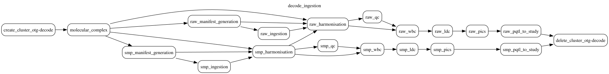

# deCODE proteomics

This document was updated on 2026-09-17.

Data source comes from the [deCODE Genetics summary data](https://www.decode.com/summarydata/). The data source is linked to 2 publications:

* Ferkingstad, E. et al. Large-scale integration of the plasma proteome with genetics and disease (2021)
* Grímur Hjörleifsson Eldjarn, Egil Ferkingstad et al. Large-scale plasma proteomics comparisons through genetics and disease associations (2023)

The data was originally fetched from s3 compatible storage and put under the `gs://decode_inputs` bucket in parquet format. This initial ingestion was run via a notebook, not the dag. The `decode_ingestion` dag now also contains `ingestion` steps that can fetch the data from the s3 compatible storage, but they are **not** wired into the active dag flow.

> [!CAUTION]
> The `ingestion` steps are expensive and re-download the full deCODE dataset from s3. The data is already present under `gs://decode_inputs`, so these steps should not be re-run just to verify they work — doing so is costly and wasteful of resources.

The data is stored under the following structure:

```{bash}
gs://decode_inputs/somascan_raw_index.txt
gs://decode_inputs/somascan_smp_index.txt
gs://decode_inputs/raw_summary_statistics/raw/
gs://decode_inputs/raw_summary_statistics/smp/
```

The syncing changed only the format from tsv.gz to parquet for easier downstream querying.

Files `gs://decode_inputs/somascan_raw_index.txt` and `gs://decode_inputs/somascan_smp_index.txt` are the index files for the raw summary statistics. (listing from s3 compatible storage)

The raw summary statistics are stored under `gs://decode_inputs/raw_summary_statistics/raw/` and `gs://decode_inputs/raw_summary_statistics/smp/` buckets. The `smp` dataset contains the median-signal-normalised summary statistics, while `raw` contains the non-normalised summary statistics. See the [Design choices](#dual-branch-smp-and-raw) section for the difference between the two.

The harmonized data is stored under the `gs://decode_data` bucket with the following structure:

```{bash}
gs://decode_data/decode_2023_aptamer_mapping.tsv
gs://decode_data/study_tables.xlsx
gs://decode_data/2021-pub-aligned/
gs://decode_data/complex_portal/
gs://decode_data/molecular_complex/
gs://decode_data/raw/
gs://decode_data/smp/
gs://decode_data/target/
```

* The `2021-pub-aligned` folder contains the conditionally analyzed credible sets from the 2021 publication supplementary tables.
* The `decode_2023_aptamer_mapping.tsv` file contains the mapping of the aptamer IDs to the ensembl gene symbols from 2021 publication supplementary tables.
* The `study_tables.xlsx` file contains the summary of the studies and their metadata.
* The `complex_portal` folder contain the [Complex Portal](https://www.ebi.ac.uk/complexportal/home) data that allows to resolve some of the aptamer IDs due to their specificity to protein complexes.
* The `molecular_complex` folder contains transformed [MolecularComplex dataset](https://github.com/opentargets/gentropy/blob/v3.3.0-rc.1/src/gentropy/dataset/molecular_complex.py) derived from Complex Portal data.
* The `raw` and `smp` folders contain the results from running the `decode_ingestion` airflow dag.
* The `target` folder contains the [Target dataset](https://opentargets.org/gentropy/python_api/datasets/target_index/) used from 26.06 Open-targets release. This dataset is used only in the `pqtl_to_study` step that maps the protein ids and protein complex ids to the up-to-date target gene ids. This step shall be migrated to the Unified Pipeline.

```{bash}
gs://decode_data/{raw,smp}/credible_set/
gs://decode_data/{raw,smp}/harmonised_summary_statistics/
gs://decode_data/{raw,smp}/harmonised_summary_statistics_qc/
gs://decode_data/{raw,smp}/manifest/
gs://decode_data/{raw,smp}/pqtl_study/
gs://decode_data/{raw,smp}/pqtl_study_qc_annotated/
gs://decode_data/{raw,smp}/study/
gs://decode_data/{raw,smp}/study_locus_ld_clumped/
gs://decode_data/{raw,smp}/study_locus_window_based_clumped/
```

The output datasets are:

* [x] [`CredibleSets`](https://opentargets.github.io/gentropy/python_api/datasets/study_locus/) stored under `gs://decode_data/{raw,smp}/credible_set/`
* [x] [`SummaryStatistics`](https://opentargets.github.io/gentropy/python_api/datasets/summary_statistics/) stored under `gs://decode_data/{raw,smp}/harmonised_summary_statistics/`
* [x] [`SummaryStatisticsQC`](https://opentargets.github.io/gentropy/python_api/datasets/summary_statistics_qc/) stored under `gs://decode_data/{raw,smp}/harmonised_summary_statistics_qc/`
* [x] [`pQTLStudyIndex`](https://github.com/opentargets/gentropy/blob/98d1f8a41515eb67a17ed2f86df345910aa2d54b/src/gentropy/dataset/study_index.py#L898) stored under `gs://decode_data/{raw,smp}/pqtl_study/`
* [x] [`deCODEManifest`](https://github.com/opentargets/gentropy/blob/98d1f8a41515eb67a17ed2f86df345910aa2d54b/src/gentropy/datasource/decode/manifest.py#L20) stored under `gs://decode_data/{raw,smp}/manifest/`, includes the information about the raw summary statistics files.
* [x] [`pQTLStudyIndexQCAnnotated`](https://github.com/opentargets/gentropy/blob/98d1f8a41515eb67a17ed2f86df345910aa2d54b/src/gentropy/dataset/study_index.py#L898) stored under `gs://decode_data/{raw,smp}/pqtl_study_qc_annotated/`. This dataset is the same as `pqtl_study` but with additional QC annotations.
* [x] [`StudyIndex`](https://opentargets.github.io/gentropy/python_api/datasets/study_index/) stored under `gs://decode_data/{raw,smp}/study/`
* [x] [`LD clumped loci`](https://opentargets.github.io/gentropy/python_api/datasets/study_locus_ld_clumped/) stored under `gs://decode_data/{raw,smp}/study_locus_ld_clumped/`. This dataset is the result of LD clumping of the Window Based Clumped Summary Statistics.
* [x] [`Window based clumped loci`](https://opentargets.github.io/gentropy/python_api/datasets/study_locus_window_based_clumped/) stored under `gs://decode_data/{raw,smp}/study_locus_window_based_clumped/`. This dataset is the result of window based clumping of the Summary Statistics.

## Processing description

### decode_ingestion dag

The **decode_ingestion.py** dag runs the deCODE ingestion pipeline on the `otg-decode` dataproc cluster. It runs once for the sample-median-protein-normalised (`smp`) summary statistics and once for the non-normalised (`raw`) ones. The two branches are serialised — `raw_harmonisation` waits on `smp_harmonisation` — so they share the cluster in sequence rather than competing for it.



Each branch runs the following processing steps:

1. **harmonisation** — builds the `pQTLStudyIndex` and harmonises the raw summary statistics (schema alignment, MAC/sample-size filtering, allele flipping against gnomAD EUR allele frequencies, EAF inference, and ATGC validation).
2. **qc** — computes `SummaryStatisticsQC` metrics and annotates the pQTL study index.
3. **wbc** — window-based clumping of the harmonised summary statistics.
4. **ldc** — LD-based clumping against the gnomAD LD index.
5. **pics** — PICS fine-mapping to produce credible sets.
6. **pqtl_to_study** — transforms the pQTL study index into the canonical `StudyIndex`, mapping protein IDs to up-to-date target gene IDs.

The dag definition also contains `molecular_complex`, `manifest_generation` and `ingestion` steps, **all commented out**. Their outputs are already materialised under `gs://decode_data`, so they are external inputs to a run rather than part of it:

| step | output it would regenerate | why it is disabled |
|---|---|---|
| `molecular_complex` | `{data_bucket}/molecular_complex/` | Complex Portal version is pinned; the existing output matches it |
| `manifest_generation` | `{data_bucket}/{smp,raw}/manifest/` | the S3 listing still matches, and this is one of the two steps that need the `decode` secret |
| `ingestion` | `gs://decode_inputs/raw_summary_statistics/` | re-downloads the full dataset from S3; see the caution above |

With `manifest_generation` and `ingestion` out, a run needs only GCS access. A run on 2026-09-16 confirmed why that matters: with them enabled, both failed with `InvalidAccessKeyId` (HTTP 403) against `s3a://largescaleplasma-2023`.

Re-enable any of them by uncommenting the node **and** restoring the matching entry in the dependent step's `prerequisites`.

The dataproc infrastructure and individual step parameters are configured in `decode_ingestion.yaml`.

The `harmonisation` and `qc` steps of both branches carry `execution_timeout_seconds: 14400` (4h). Airflow does not kill a task that is merely slow, and a stalled harmonisation on 2026-07-02 accrued roughly £1,000 before it was noticed. The downstream `wbc`, `ldc` and `pics` steps operate on KiB-MiB and are left unbounded.

> [!NOTE]
> S3 credentials for the `manifest_generation` and `ingestion` steps are stored in the GCP Secret Manager `decode` secret, which the cluster init action writes to `/var/run/secrets/decode`. Those steps read them via `step.session.add_s3_connector: true` and `step.session.s3_configuration_path: /var/run/secrets/decode`.

### S3 credentials secret

The deCODE summary statistics live in an S3-compatible bucket that requires credentials. These are obtained from the deCODE team once authenticated at <https://www.decode.com/summarydata/>. The credentials must be stored as the `decode` secret in GCP Secret Manager as a JSON blob matching the [`gentropy.external.s3.S3Config`](https://github.com/opentargets/gentropy/blob/v3.3.0-dev.61/src/gentropy/external/s3/__init__.py) model, which gentropy loads via `S3Config.from_json` to build the S3 connector:

```json
{
  "bucket_name": "<bucket-name>",
  "s3_host_url": "<s3-host>",
  "s3_host_port": "<s3-port>",
  "access_key_id": "<access-key-id>",
  "secret_access_key": "<secret-access-key>"
}
```

`bucket_name` is the bucket without any `s3://` or `s3a://` prefix; `s3_host_url`/`s3_host_port` describe the S3-compatible endpoint; `access_key_id`/`secret_access_key` are the credentials provided by the deCODE team. The cluster init action (`fetch_secrets.sh`, configured via `secret_blob_list: ['decode']`) writes this blob verbatim to `/var/run/secrets/decode`, which is the path the `manifest_generation` and `ingestion` steps read from. Without this secret in place the S3-fetching steps cannot run.

## Design choices

A number of deliberate choices were made during ingestion and fine-mapping. They are recorded here so they are not silently reverted.

### Dual branch: `smp` and `raw`

`smp` and `raw` are **not the same data processed two ways** — they are two distinct SomaScan output datasets that differ in how the protein measurements were normalised:

* **`smp`** — the median-signal-normalised measurements. This is the standard SomaScan normalisation step that rescales each sample so that the per-plate median signal matches a reference, correcting for technical/assay variance between samples and plates (it substantially reduces the inter-plate coefficient of variation). It is the SomaLogic-recommended output for most analyses.
* **`raw`** — the non-median-normalised measurements. Sample-level median normalisation can mask true biological signal in study designs with heterogeneous samples (where a shifted median is itself biologically meaningful), so the unnormalised data is retained as an alternative view.

The pipeline runs both datasets through an identical processing structure (differing only in input/output prefixes). Keeping both serves two purposes: downstream consumers can choose the normalisation appropriate to their analysis, and — because the two represent the same cohort under different normalisation — they let us test the LD-safe method of inferring LD directly from the summary statistics across both the normalised and non-normalised signal.

### Significance threshold (`gwas_significance = 1.8e-9`)

Window-based clumping uses `1.8e-9` rather than the genome-wide default of `5e-8`. This is the study-wide significance threshold reported in the deCODE publications mentioned above, and we adopt it verbatim to stay consistent with the source study.

### MAC and sample-size filters (`min_mac_threshold = 50`, `min_sample_size_threshold = 30000`)

Variants are required to have a minor allele count ≥ 50 and a sample size ≥ 30,000. These thresholds remove very rare variants whose effect-size and standard-error estimates are unstable. Combined, they imply a minimum covered allele frequency of roughly `MAC / (2 × N) = 50 / (2 × 30000) ≈ 8.3e-4` (~0.08%); variants below this are not retained.

### Ambiguous and ATGC alleles (`remove_ambiguous_alleles = false`, `verify_atgc = true`, `remove_equal_alleles = true`)

Strand-ambiguous variants (A/T, C/G) are **not** removed. Allele direction is resolved by flipping against the gnomAD `variant_direction` reference: ambiguous variants that match gnomAD are flipped, and those with no gnomAD match are retained unflipped instead of being dropped. This deliberately preserves novel variants that fall outside the non-Finnish-European (nfe) / European gnomAD reference — which matters for deCODE, since the Icelandic study includes rare and imputed variants not well represented in nfe.

`verify_atgc = true` keeps only canonical A/T/G/C alleles (this also drops `*` star and `!` multiallelic markers), and `remove_equal_alleles = true` drops variants whose effect and other alleles are identical.

### Allele frequency alignment to gnomAD nfe

The source data only provides the minor allele frequency (MAF), and the effect allele is not necessarily the minor allele. During harmonisation the allele frequency is therefore aligned to the gnomAD nfe reference, so that the reported `effectAllele` frequency is consistent and refers to the effect allele rather than the minor allele.

### Fine-mapping with PICS on lead variants

deCODE does not provide per-study LD for the Icelandic population, so in-sample / matched-LD fine-mapping (e.g. SuSiE) is not possible. Instead, the pipeline clumps to lead variants (window-based → LD-based clumping) and fine-maps with **PICS** using out-of-sample (gnomAD nfe) LD. Where a lead variant is present in the nfe population, PICS expands it using the reference LD; otherwise the credible set reduces to a single-variant association rather than a locus.

This is acceptable because the deCODE study is well powered — it includes rare variants and in-sample genome imputation — so single-variant associations carry meaningful power even when no reference LD is available.

### Window-based clumping keeps leads only (`collect_locus = false`)

Window-based clumping retains only the lead variants and does not collect the surrounding locus. The locus expansion is performed later by PICS (using reference LD as described above), so collecting it during clumping would be redundant. We use the same window size as the deCODE publication (±1Mb) to stay consistent with the source study.

### Enhanced Flexibility Mode protects shuffle files only

`dataproc:efm.spark.shuffle=primary-worker` pins **shuffle files** to the fixed primary pool, which is why secondary workers can autoscale freely. Spark **cache blocks** fall outside that protection: they live on whichever executor computed them, including autoscaled preemptible secondaries. A persist-heavy job therefore loses cached partitions on every scale-down and recomputes them, which generates more shuffle and triggers more scale-up.

This is why the harmonisation step in gentropy streams its intermediates instead of caching them ([gentropy#1292](https://github.com/opentargets/gentropy/pull/1292)) — the job is the level this belongs at.

> [!CAUTION]
> `gracefulDecommissionTimeout` **must be `0s`** on any policy used with `dataproc:efm.spark.shuffle=primary-worker`. Dataproc rejects cluster creation outright otherwise:
>
> ```
> InvalidArgument: 400 When Spark primary worker shuffle is enabled
> (dataproc:efm.spark.shuffle=primary-worker), the graceful decommissioning
> timeout must be 0. See SPARK-30873 for more information.
> ```
>
> The `0s` is a requirement of EFM. Raising it to `120s` was attempted and broke cluster creation for both policies; both are back at `0s`. Per the same error message, secondary workers can be removed with no graceful decommissioning and in-progress tasks are simply retried, so the protection is redundant here. The recompute-on-decommission concern belongs in the job, which gentropy#1292 addresses by streaming instead of caching.

The autoscaling policy is a live GCP resource that lives in GCP rather than this repository — the DAG references it by name. To inspect or change it:

```{bash}
gcloud dataproc autoscaling-policies export otg-decode-efm \
  --region=europe-west1 --project=open-targets-genetics-dev --destination=policy.yaml
# edit, then
gcloud dataproc autoscaling-policies import otg-decode-efm \
  --region=europe-west1 --project=open-targets-genetics-dev --source=policy.yaml
```

### Shuffle partitions stay at 16000 in Prod

Raising `spark.sql.shuffle.partitions` above 16000 was proposed as the main tuning lever, and the value stays at 16000. Both dominant shuffles are bounded elsewhere: harmonisation clusters by `studyId`, whose cardinality (~4,961) caps the number of non-empty partitions. A higher count adds empty tasks while per-task work stays the same. A test in `test_dag_validation.py` asserts the Prod value, so the decision survives habit and environment flips.

Test drops to 200, because hashing a 3-study subset into 16000 buckets is pure scheduling overhead.

### Spill is what fills the primary disks

Under EFM every shuffle byte lands on the 15 primaries, so their local dirs are the binding constraint. The 2026-09-16 event log (`application_1789581202859_0002`) gives the split:

| stage | tasks | shuffle write | disk spill | input read | operation |
|---:|---:|---:|---:|---:|---|
| 7 | 6,700 | 6.33 TiB | **5.12 TiB** | 3.16 TiB | sumstats side of the gnomAD join |
| 8 | 258 | 45.8 GiB | – | 33.7 GiB | `variant_direction` side |
| 20 | 16,000 | 6.03 TiB | **4.48 TiB** | – | `repartition("studyId")` |
| | | **12.40 TiB** | **9.59 TiB** | | |

The 12.40 TiB of shuffle is the data itself, and shrinks only with an algorithm change. The 9.59 TiB of spill was avoidable, and it is what pushed five primaries past YARN's 90% local-dir threshold, at which point YARN marks the node unhealthy and releases its containers — surfacing to Spark as `Exit status: -100, Container released on a *lost* node`.

Two settings caused it, and both are now tuned:

* `spark.sql.files.maxPartitionBytes` was `1g`, the value the EFM docs suggest. That gave stage 7 only 6,700 tasks for 3.16 TiB of input — 495 MB each. Now `100m`.
* `spark.executor.cores` was unset, so Dataproc derived 8 cores against a 27,426 MB heap. Execution memory is `27426 × 0.6 ÷ 8 ≈ 2 GB` per task, and the spill messages landed at exactly `1984.0 MiB`. Now `4`, which doubles it. Total cores stay the same — YARN packs more executors per node.

With those applied the same 15 × 1024 GB completed the `smp` branch.

> [!TIP]
> When a run dies on disk, read the event log rather than resizing. It is at
> `gs://dataproc-temp-<region>-<project-number>-<suffix>/<cluster-uuid>/spark-job-history/`,
> and `SparkListenerStageCompleted` events carry per-stage `shuffle.write.bytesWritten`
> and `diskBytesSpilled`. The plan's `Statistics(sizeInBytes=...)` is a logical estimate
> of uncompressed row-format size and runs several times larger than the bytes actually
> written. Size disk from the written bytes.

### Cluster sizing is environment-scoped

`environment_specs` carries the cluster sizing as well as the bucket paths, so a Test run provisions its own smaller cluster:

| | Prod | Test |
|---|---|---|
| autoscaling policy | `otg-decode-efm` | `otg-decode-test` |
| primary workers | 15 × `n2-standard-16` | 4 × `n2-standard-16` |
| primary disk | 1024 GB `pd-ssd` | 500 GB `pd-balanced` |
| master | `n2-standard-16` | `n2-standard-8` |
| `shuffle.partitions` | 16000 | 200 |

Each environment has its **own** autoscaling policy. An autoscaling policy governs the primary worker count, so pointing Test at `otg-decode-efm` would silently override the smaller `num_workers` — that policy pins `min=max=15` — and hand a Test run the production cluster anyway.

`otg-decode-test` mirrors the EFM shape of `otg-decode-efm` at small scale: primaries fixed at `min=max=4` so they can hold shuffle, secondaries pure compute autoscaling `0-8`, and `gracefulDecommissionTimeout: 0s` as EFM requires (see the caution above).

Test keeps 16-vCPU workers because the gnomAD `variant_direction` join stays full size whatever the study subset — the reference is read and shuffled in full regardless of how few studies are harmonised.

Neither policy is defined in this repository; both are live GCP resources referenced by name. See the export/import commands above.

> [!IMPORTANT]
> `env:` in the config selects the environment for every run of the dag. Check it before triggering: with `env: Prod` a run reads `gs://decode_inputs` and overwrites `gs://decode_data`.

Sentinels are substituted textually **before** the YAML is parsed, so every value in `environment_specs` is a string and every placeholder at the use site is quoted. Quoting keeps the pre-substitution file valid and meaningful YAML — an unquoted `{placeholder}` parses as a nested mapping rather than a scalar — and the integer cluster fields are coerced from string by the `CustomClusterConfig` pydantic model. A test asserts that coercion and builds the cluster spec for both environments, so a value that failed to convert would fail in CI rather than at cluster creation.

## Changelog

### 2026-06-30

* [Inclusion of the `deCODE` ingestion dag](https://github.com/opentargets/issues/issues/4140)

### 2026-09-15

* Bumped `gentropy_ref` to `3.4.0-dev.11`, which carries the deCODE duplication fixes and the single-pass, cache-free harmonisation ([gentropy#1292](https://github.com/opentargets/gentropy/pull/1292)).
* Added a 4h `execution_timeout` to the `harmonisation` and `qc` steps of both branches.
* Created the `otg-decode-test` autoscaling policy (primaries `min=max=4`, secondaries `0-8`) so a Test run provisions its own smaller cluster.
* Reverted an attempt to raise `gracefulDecommissionTimeout` from `0s` to `120s` on `otg-decode-efm`: EFM primary-worker shuffle requires `0s` and Dataproc rejects cluster creation otherwise.
* Copied the `target/` index into the Test bucket so `pqtl_to_study` can run there.
* Prepared for the rerun that resolves the duplicated credible sets in [opentargets/issues#4481](https://github.com/opentargets/issues/issues/4481).

### 2026-09-17

* Bumped `gentropy_ref` to `3.4.0-dev.15`, which adds the unresolved-target drop in `to_study` and removes a redundant shuffle and sort from the harmonisation write path.
* Set `spark.sql.files.maxPartitionBytes` to `100m` and `spark.executor.cores` to `4`, which together removed the disk spill that had been evicting primary workers. See [Spill is what fills the primary disks](#spill-is-what-fills-the-primary-disks).
* Disabled the `molecular_complex` and `manifest_generation` steps; their outputs are already materialised, and leaving them out keeps a run clear of the `decode` S3 credentials.
* Ran the `smp` branch to completion against production. **[opentargets/issues#4481](https://github.com/opentargets/issues/issues/4481) is resolved**:

  | dataset | rows | distinct | duplicates |
  |---|---:|---:|---|
  | `smp/pqtl_study` | 4,961 | 4,961 studyId | 0 |
  | `smp/study` | 4,993 | 4,934 studyId | 0 duplicated `(studyId, geneId)`, 0 null `geneId` |
  | `smp/credible_set` | 46,336 | 46,336 studyLocusId | 0 |

  Before the rerun these were 4,961/4,960, 48 duplicated `(studyId, geneId)` pairs with 35 null `geneId` rows, and 4 duplicated `studyLocusId`. The multi-row studyIds that remain in `study` are the intended one-row-per-target explosion for multi-target aptamers.
