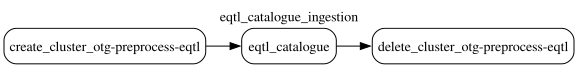

# EQTL Catalogue

This document was updated on 2026-09-01.

This datasource is currently fixed under the [eQTL Catalogue Release 7 - June 2024](https://www.ebi.ac.uk/eqtl/Release_notes/#:~:text=eQTL%20Catalogue%20release%207%20%2D%20June%202024) for the public release.
This datasource is currently fixed under the [eQTL Catalogue Release 8](https://www.ebi.ac.uk/eqtl/Release_notes/#:~:text=eQTL%20Catalogue%20r8%20pre%2Drelease%20%2D%20January%202026) for the PPP release.

Data source comes from the `https://www.ebi.ac.uk/eqtl/`

Data stored under `gs://eqtl_catalogue_data` bucket comes with following structure

```{bash}
gs://eqtl_catalogue_data/credible_set_datasets/eqtl_catalogue_susie/
gs://eqtl_catalogue_data/credible_set_datasets/eqtl_catalogue_susie_patched/
gs://eqtl_catalogue_data/credible_set_datasets/eqtl_catalogue_susie_patched_v2/
gs://eqtl_catalogue_data/docs/
gs://eqtl_catalogue_data/ebi_ftp/susie/
gs://eqtl_catalogue_data/otar2077/
gs://eqtl_catalogue_data/study_index/
gs://eqtl_catalogue_data/study_locus_datasets/
gs://eqtl_catalogue_data/r8/study_index/
gs://eqtl_catalogue_data/r8/credible_set/
```

## Preprocessing

> [!Warning]
> Initially the _eqtl summary statistics_ were harmonised by the gentropy and finemapped with pics - see https://github.com/opentargets/gentropy/pull/238. The results of that finemapping can be found in `gs://eqtl_catalogue_data/study_locus_datasets/` and `gs://eqtl_catalogue_data/credible_set_datasets/eqtl_catalog_picsed/`
> This approach was changed to SuSIE finemapping results are ingested as the source of the `credible sets` - see https://github.com/opentargets/issues/issues/3235.

Up from 2026.09 the ingestion dag no longer allows for using tsv.gz files, please use eQTL catalogue susie results in parquet format (susie + lbf_variable). See ftp for reference.

## Processing description

### eqtl_catalogue_ingestion dag

The **qetl_catalogue_ingestion.py** dag contains following steps:



The dag consists of 1 step:

1. Run eqtl_catalogue step to create a study index and credible sets. Step running on dataproc - to see the reference check - [eqtl_catalogue step](https://opentargets.github.io/gentropy/python_api/steps/eqtl_catalogue/)

The dag was updated to use the [qtlmap](https://github.com/eQTL-Catalogue/qtlmap) outputs in parquet format, the dag no longer supports the eqtl Catalogue r7 release data transformation in gzipped tsv format.

The output datasets from the dataproc job are:

### r7 (currently publicly available)

- [x] [`StudyIndex`](https://opentargets.github.io/gentropy/python_api/datasets/study_index/) stored under `gs://eqtl_catalogue_data/study_index/`
- [x] [`CredibleSets`](https://opentargets.github.io/gentropy/python_api/datasets/study_locus/) stored under `gs://eqtl_catalogue_data/credible_set_datasets/eqtl_catalogue_susie_patched_v2/`

### r8 (currently PPP available)

- [x] [`StudyIndex`](https://opentargets.github.io/gentropy/python_api/datasets/study_index/) stored under `gs://eqtl_catalogue_data/r8/study_index/`
- [x] [`CredibleSets`](https://opentargets.github.io/gentropy/python_api/datasets/study_locus/) stored under `gs://eqtl_catalogue_data/r8/credible_set/`

The configuration of the dataproc infrastructure and individual step parameters can be found in `eqtl_catalogue_ingestion.yaml` file.

> [!NOTE]
> The outputs of the steps are contained in the target bucket with prefix _eqtl_catalogue_susie_patched_v2_. The original credible sets are stored under `gs://eqtl_catalogue_data/credible_set_datasets/eqtl_catalogue_susie/`.
> The patched credible sets for r7 have fixed the issue with the sum of Posterior Probabilities [see issue](https://github.com/opentargets/issues/issues/3566)
> The r8 credible sets for two projects `QTS000008` and `QTS000042` were patched to scale `posteriorProbability` values to range `[0,1]` using lbfs [see issue](https://github.com/opentargets/issues/issues/4496)


## Changelog

### 2025-02-05

- [fix: reclassify eqtl catalogue sc datasets #894](https://github.com/opentargets/gentropy/pull/894)
- [feat(qtls): flagging trans QTL credible sets #973](https://github.com/opentargets/gentropy/pull/973)
- [chore: removing symbols from QTL study identifiers #971](https://github.com/opentargets/gentropy/pull/971)
- [refactor(eqtl catalogue): update dag structure for r8 release](https://github.com/opentargets/issues/issues/4421)
