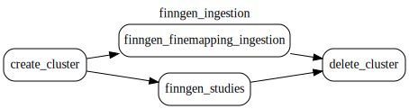

# Finngen

This document was updated on 2025-07-22.

This datasource is currently fixed under [Finngen Data Freeze 12 - November 4 2024](https://r12.finngen.fi/)

Data source comes from the bucket `gs://finngen-public-data-r12/` hosted by Finngen.

Data is stored under `gs://finngen_data/r12` comes with following structure

```{bash}
gs://finngen_data/r12/credible_set_datasets/susie
gs://finngen_data/r12/study_index/
```

## Preprocessing

Raw data is fetched by the gentropy steps directly from the data source. No preprocessing steps are required.

The fetching paths are:

- snp files from `gs://finngen-public-data-r12/finemap/full/susie/*.snp.bgz`
- credible_set files from `gs://finngen-public-data-r12/finemap/summary/*SUSIE.cred.summary.tsv`

## Processing description

### finngen_ingestion dag

The **finngen_ingestion.py** dag contains following steps:



The dag consists of 2 steps:

1. finngen_studies - Step that creates the StudyIndex dataset
2. finngen_finemapping_ingestion - Step that ingests the SuSiE finemapping results from Finngen datasource to CredibleSet dataset.

Steps run in parallel in the dataproc cluster.

The output datasets are:

- [x] [`StudyIndex`](https://opentargets.github.io/gentropy/python_api/datasets/study_index/) stored under `gs://finngen_data/r12/study_index/`
- [x] [`CredibleSets`](https://opentargets.github.io/gentropy/python_api/datasets/study_locus/) stored under `gs://finngen_data/r12/credible_set_datasets/susie/`

The configuration of the dataproc infrastructure and individual step parameters can be found in `finngen_ingestion.yaml` file.

## Changelog

### 2025-02-05

- [fix: updating info in finngen study index ingestion (#972)](https://github.com/opentargets/gentropy/pull/972)

### 2025-04-11

- chore: removal of r11 and r10 data to prevent data duplication.

### 2025-07-24

- [feat: updated finngen studyIndex to contain pubmedId upon ingestion](https://github.com/opentargets/issues/issues/3946)

### 2026-05-20

- [feat: rerun study index generation to include latest EFO changes](https://github.com/opentargets/issues/issues/4344)
