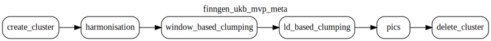

# FinnGen UK Biobank Million Veteran Program (MVP) Meta analysis

This document was updated on 2025-10-27.

Data source comes from the `gs://finngen-public-data-r12/`

Data stored under `gs://finngen_ukb_mvp_meta_data` bucket comes with following structure:

```{bash}
gs://finngen_ukb_mvp_meta_data/credible_sets/
gs://finngen_ukb_mvp_meta_data/harmonised_summary_statistics/
gs://finngen_ukb_mvp_meta_data/harmonised_summary_statistics_qc/
gs://finngen_ukb_mvp_meta_data/raw_summary_statistics/
gs://finngen_ukb_mvp_meta_data/study_index/
gs://finngen_ukb_mvp_meta_data/study_locus_ld_clumped/
gs://finngen_ukb_mvp_meta_data/study_locus_window_based_clumped
```

## Processing description

The full description of the process can be found in [issue](https://github.com/opentargets/issues/issues/3474)

## Orchestration steps

### finngen_ukb_mvp_meta_dag

**Dag** contains 4 steps:

- summary statistics harmonisation

- window based clumping - [StudyLocus](https://opentargets.github.io/gentropy/python_api/datasets/study_locus/)
- ld based clumping - [StudyLocus](https://opentargets.github.io/gentropy/python_api/datasets/study_locus/)
- pics finemapping - [StudyLocus](https://opentargets.github.io/gentropy/python_api/datasets/credible_sets/)

The configuration of the dataproc infrastructure and individual step parameters can be found in `finngen_ukb_mvp_meta.yaml` file.



### harmonisation

The step that performs following tasks:

- Building study index from finngen manifest - [StudyIndex](https://opentargets.github.io/gentropy/python_api/datasets/study_index/)
- Downloading raw summary statistics from finngen-public-data-r12 bucket and conversion to `parquet` format based on summary statistics paths found in the finngen manifest
- Harmonisation of raw summary statistics to the [SummaryStatistics](https://opentargets.github.io/gentropy/python_api/datasets/summary_statistics/)
- Running quality controls on harmonised summary statistics
- Updating study index with qc results [SummaryStatisticsQC](https://opentargets.github.io/gentropy/python_api/datasets/summary_statistics_qc/)

### window_based_clumping

The step that performs the [window_based_clumping](https://opentargets.github.io/gentropy/python_api/methods/clumping/) on harmonised summary statistics.

### ld_based_clumping - sumstats

The step that performs [ld_clumping](https://opentargets.github.io/gentropy/python_api/methods/clumping/) on the results from window based clumping step.

### pics - sumstats

The step that performs [PICS finemapping](https://opentargets.github.io/gentropy/python_api/methods/pics/) based on the ld clumped study locus dataset to obtain the dataset containing credible sets.

## BGzip enhanced codec

Due to the fact that original summary statistics files are stored in bgzip compressed tsv files, we have two ways of handling them in the spark environment:

1. Download the files, decompress and transform to parquet format - solution used in `ukb_ppp_eur_harmonisation` pre-processing step. Not optimal, as it requires to split the pipeline into two steps (download + harmonisation done via google batch job once) and harmonisation (done via dataproc cluster).
2. Use the [BGzipCodec](https://opentargets.github.io/gentropy/python_api/codecs/bgzip/) to read the files directly in their compressed format with distributed manner (each block can be read independently).

In the case of `finngen_ukb_mvp_meta_dag` we are using the (2).

> [!WARNING]
> To enable the Enhanced BGzip codec, we need to pre-set in the `dataproc` cluster, as downloading it via the SparkSession (setting in gentropy) fails to load the codec on workers.
> This is allowed via the `dataproc.use_enhanced_bgzip_codec` configuration block in `finngen_ukb_mvp_meta.yaml` file.

## Changelog

- 2025-10-27: Build documentation, initial pipeline run.
