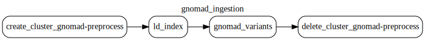

# Gnomad data

Open targets utilizes two datasets comming from [gnomad downloads](https://gnomad.broadinstitute.org/data).
These include:

- gnomAD LD matrices v2.1.1 [Linkage disequilibrium](https://gnomad.broadinstitute.org/data#v2-linkage-disequilibrium)
- gnomAD variant_index (based on [gnomad variants](https://gnomad.broadinstitute.org/data#v4-variants))

Open targets ingest both datasets in `gnomad_ingestion` dag.

The output of these steps is saved to `gs://gnomad_data_2` bucket.

```
gs://gnomad_data_2/v2.1.1/ld_index/
gs://gnomad_data_2/v4.1/variant_index/
gs://gnomad_data_2/grch37_to_grch38.over.chain
```



## Changelog

### 2025-04-11

- chore: add documentation of gnomad_ingestion dag.
