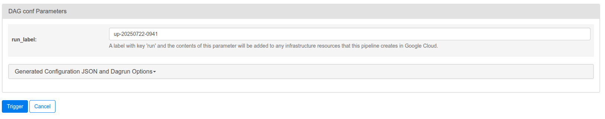
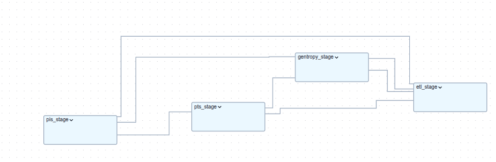
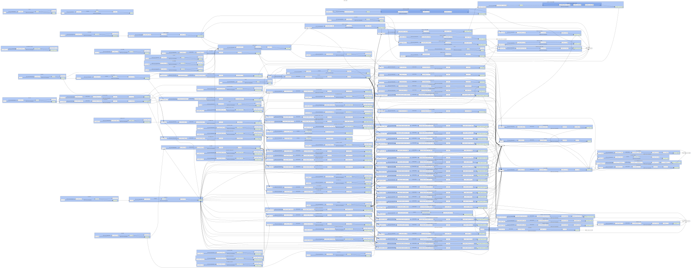

# Introduction to Unified Pipeline DAG

The Unified Pipeline is main OpenTargets pipeline that streamlines the data release process for [Open Targets Platform](https://platform.opentargets.org/).

## Dag structure

Dag is divided into 4 stages:

1. **Platform Input Stage (PIS)** - This stage is responsible for collecting and preparing the **input data for the pipeline**. It includes steps like fetching data from various sources, the full transfer configuration is defined in the [pis.yaml](../../src/orchestration/dags/config/pis.yaml) file. This step ensures the process reproducible. This step uses [PIS](https://github.com/opentargets/pis) as a tool to process the data.

2. **Platform Transformation Stage (PTS)** - This stage is responsible for **transforming the input data**. The transformations are defined in the [pts.yaml](../../src/orchestration/dags/config/pts.yaml) file. This step uses [PTS](https://github.com/opentargets/pts) as a tool to process the data.

3. **Platform ETL Stage (ETL)** - This stage is is also responsible for **transforming the input data into platform evidence**. The transformations are defined in the [etl.conf](../../src/orchestration/dags/config/etl.conf) file. The tasks implemented in this stage are running on Spark clusters, which are defined in the [clusters.yaml](../../src/orchestration/dags/config/clusters.yaml) file. This step uses [platform ETL backend](https://github.com/opentargets/platform-etl-backend) as a tool to process the data.

4. **Platform Genetics Stage (Gentropy)** - This stage is responsible for **transforming genetics data into platform evidence (L2G)**. The transformations are defined in the [gentropy.yaml](../../src/orchestration/dags/config/gentropy.yaml) file. The tasks implemented in this stage are running on Spark clusters, which are defined in the [clusters.yaml](../../src/orchestration/dags/config/clusters.yaml) file. This step uses [gentropy](https://github.com/opentargets/gentropy) as a tool to process the genetics data.

## Task topology

Tasks topology is defined in the [unified_pipeline.yaml](../../src/orchestration/dags/config/unified_pipeline.yaml) file. This file defines the **steps** that should be executed in the pipeline run, along with the information on what steps are required to be executed before the current step.

## Configuration

To explore the configuration of the Unified Pipeline, you can refer to the [Unified Pipeline configuration documentation](config.md).

## Triggering the DAG

To trigger the Unified Pipeline DAG, one should do that using the Airflow instance created by following command:

```{bash}
make
```

More information on how to run the Airflow instance can be found in the [README](../../README.md#google-cloud) file.

[!NOTE]
> The Airflow instance is created in the OpenTargets Platform infrastructure. Currently this can be done only by the OpenTargets Platform team.

The above command will create the Airflow instance, make a tunnel to the Airflow UI. Then you can trigger the DAG from the Airflow UI.



### How dag looks like

Top level dag is defined as 4 task groups (each corresponds to a single stage)



---

After uncollapsing the task groups the dag complexity looks like:


